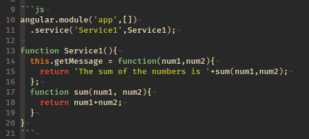

The entire setup is available at [https://github.com/pvamshi/vamshi.github.io](https://github.com/pvamshi/vamshi.github.io)

### Dream 

I wanted to have a blog site of my own with the following features : 

- Content written in markdown
- Source on public repository , so that errors can be fixed by anyone with pull requests
- Free hosting, obviously !
- Configurable to an extent that I can use my own frameworks and libraries , even host a site if needed
- Build automatically. The idea is I can edit the file in github using its own editor (or merge pull request) and it gets updated in the website

### Current setup
It has been a long journey trying out different combinations, but I will explain the current working setup. 

Purpose | Service/Framework used
--------|--------
Free hosting | [Github Pages](https://pages.github.com/)
Source Code Repository | [Github](https://github.com)
Site Generator | [Harp](https://harpjs.com)
Automated build | [Circle CI](https://circleci.com)
CSS framework | [Materialize](http://materializecss.com/)
Code Highlighting | [Prism](http://prismjs.com)
Comments & Social buttons (in progress) | [Facebook](http://developers.facebook.com)

#### Why host on gihub
In other words why not use awesome blog sites like medium or wordpress?

I was very much in favor of [Medium](http://medium.com) until I realized they don't have code highlighting and I need to rely on [gists](http://gist.github.com) to create the code snippets. I think its a really cumbersome job to keep updating code at gists compared to markdown style in-text editing using backticks. More over it was one of my goals to use markdown ( so that I can use vim, somehow everything boils down to vim).

Using markdown , I can write the code using `  followed by the language (like `` ```js``). Using vim, I can even get syntax highlighting. Check the screenshot below: 



#### How to host on github pages 
- create a project with page name , like `pvamshi.github.io` 
- Go to settings , scroll down to Github pages
- Choose a branch
- Choose a theme 
- Enable the site 

Detailed explanation can be found at [https://pages.github.com/](https://pages.github.com/). 

 ( to be continued ..)

